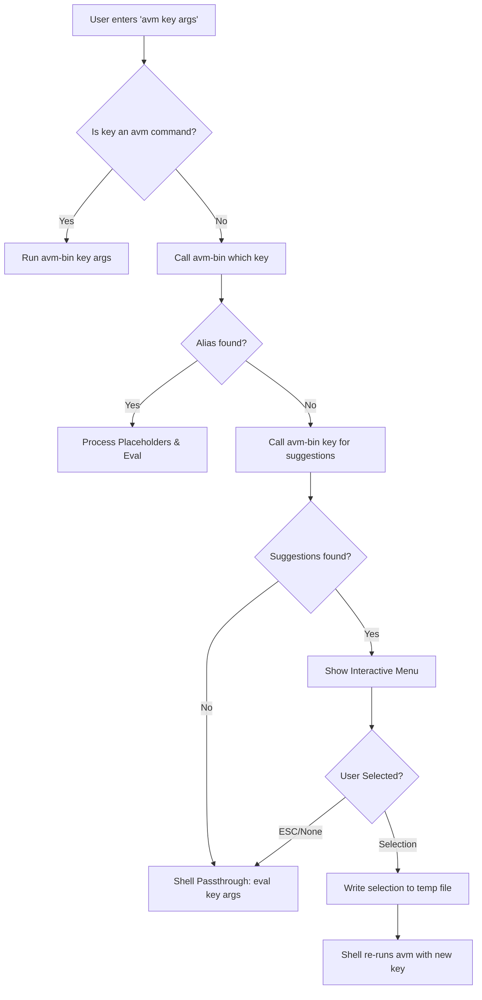

# avm — Execution Flow

This document visualizes the journey of a command from the terminal through the `avm` engine and back to the shell.

---

## 1. The Entry Point
When you run `avm my-cmd args`, the shell function `avm()` in your `.zshrc`/`.bashrc` takes control.

---

## 2. Alias Resolution (Internal)
When resolving aliases, `avm` loads:
1.  **Load Local**: Reads `./.avm.json`. Returns aliases if found.
2.  **Load Global**: Reads `~/.avm.json`. Returns aliases if found.
3.  **Resolve Environment**: Merges `env` from local and global config (`local` wins on conflict).
4.  **Execute Plugins**:
    - Discovers plugins in `~/.avm/plugins/`.
    - Spawns a bounded worker pool.
    - For each plugin, runs `bin/health-check` (if exists).
    - If health-check passes, runs `bin/export-aliases --dir <cwd>`.
    - Merges results into the alias pool.
4.  **Exit**: Returns error string to stderr and exit code 0 if not found.

## 3. Placeholder Substitution Logic
If an alias string contains `$1`, `$2`, etc.:
1.  The shell function `avm` iterates through the arguments provided by the user.
2.  It uses `sed` to replace each `$i` with the corresponding argument.
3.  Any remaining placeholders (e.g., if you provided 2 args but the alias has 3) are stripped.
4.  The resulting string is passed to `eval`.

## 4. Interactive Suggestion Loop
1.  The Go binary performs fuzzy matching.
2.  If matches exist, it starts a `promptui` selection.
3.  The binary exits with **Exit Code 10**.
4.  The shell function sees Code 10, reads the temp file set in `AVM_RESULT_FILE`, and triggers a recursion: `avm "$suggestion"`.
5.  This ensures that the selected suggestion is resolved exactly like a normal alias (handling its placeholders, etc.).
